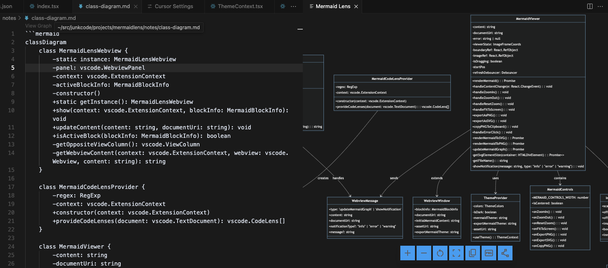

# Mermaid Lens

[](https://github.com/benlau/mermaidlens/actions)

Mermaid Lens is a Visual Studio Code extension that provides a zoomable Mermaid diagram viewer. It allows you to view, zoom, and export Mermaid diagrams as PNG/SVG to file/clipboard directly within your Markdown file.



## Features

- **Interactive Diagram Viewer**
  - Zoom in/out, drag, functionality
  - Mouse wheel zooming with center point preservation
  - 1:1 scale and fit-to-screen options
  - Theme-aware rendering (matches VSCode theme)

- **Export Capabilities**
  - Export diagrams as PNG
  - Export diagrams as SVG
  - Export diagram (PNG) to clipboard
  - The export Mermaid graph style is customizable that can be different the preview style

## Installation

1. Open Visual Studio Code
2. Press `Ctrl+Shift+X` (Windows/Linux) or `Cmd+Shift+X` (Mac) to open the Extensions view
3. Search for "Mermaid Lens"
4. Click Install

Alternatively, you can install it from the [Visual Studio Code Marketplace](https://marketplace.visualstudio.com/items?itemName=ubw.mermaidlens).

## Usage

1. Open a markdown file containing Mermaid diagrams
2. Click the "View Graph" code lens that appears above Mermaid code blocks
3. The diagram will open in a side panel

Change the export Mermaid graph theme:

1. Open VS Code settings
2. Search for `mermaidlens.exportMermaidTheme`
3. Change the value from `auto` to `default`, `neutral`, `dark`, `forest`

## Development

### Prerequisites

- Node.js
- npm
- Visual Studio Code

### Setup

1. Clone the repository:
   ```bash
   git clone https://github.com/benlau/mermaidlens.git
   cd mermaidlens
   ```

2. Install dependencies:
   ```bash
   npm install
   ```

3. Build the extension:
   ```bash
   npm run build
   npm run pack
   ```

4. Install the vsix file

## Contributing

Contributions are welcome! Please feel free to submit a Pull Request.

## License

This project is licensed under the MIT License.